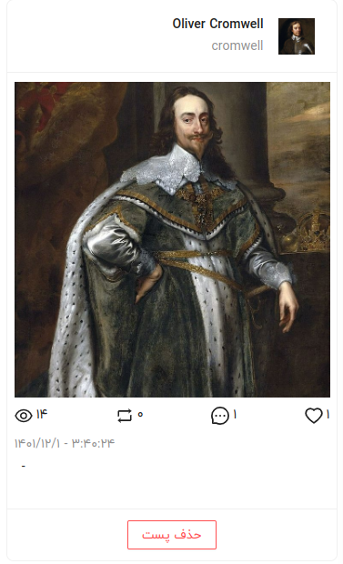

## Requirements

1. Run the following code to install the json-server for make api \
   `npm install -g json-server`
2. After install run \
   `json-server --watch db.json`
3. Now available apis are \
   `GET http://localhost:3000/posts` \
   `DELETE http://localhost:3000/posts/{id}`
4.  In another terminal run `npm install`
5. To see your project live `npm run dev`

## Assignment

- [x] Get the posts list from api
- [x] Display each item in the card as shown in the following image

- [x] By clicking the delete button, you must call the api and delete the intended post from dp.json.

*For all profile photos import the `profile.jpg` from the `src/assets` directory* \
*For all post images import the `postImage.jpg` from the `src/assets` directory*